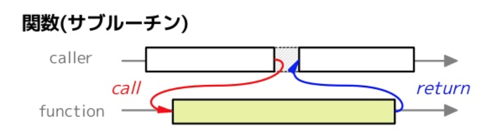
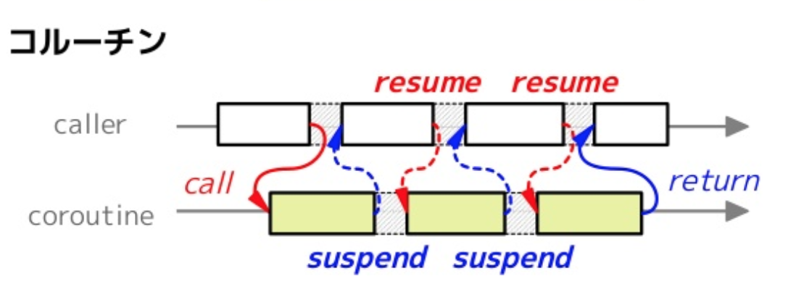

# なぜ非同期処理が必要なのか

それでは、なぜ非同期処理が重要になったのでしょうか？

まずは歴史から入ってみましょう。

## C10K 問題

「C10K 問題(クライアント 10,000 台問題)」とは一言でいうと、ハードウェアの性能上は問題がなくともクライアントの数があまりにも多くなると(およそ 10,000 台)レスポンス性能が大きく低下する問題です。これは、1 つの接続ごとに対応するプロセスやスレッドを割り当てるという方式では限界が来ているという問題です。

１つの接続ごとに対応するプロセスやスレッドを生成するとメモリ上にプロセスやスレッドの管理領域が確保されます。このとき、スレッドやプロセスを１つ起動するには数 KB ~ 数 MB のメモリが必要になります。そのため、同時に 10,000 ものアクセスがあると、数十 GB のメモリが必要になり、メモリが枯渇してしまいます。また、実行するプロセスやスレッドを切り替える際のコンテキストスイッチのオーバーヘッドが大きくなり、本来やるべき処理に時間が避けなくなってしまうという問題点もあります。

これを聞いて疑問が湧いた人がいるかも知れませんね。

コンテキストスイッチのオーバーヘッドとは具体的に何か？

次はコンテキストスイッチに掛かるコストについて話していきます。

## コンテキストスイッチのオーバーヘッドとは具体的に何か？

プロセスのコンテキストスイッチ時のコストは次のものがあります。

- プロセスのすべての CPU レジスタのコンテキストを保存し、他のプロセスの値を復元する必要がある。
- CPU の仮想アドレスから物理アドレスのマッピングを切り替える必要がある。
- MMU キャッシュのクリア

「MMU キャッシュのクリア」について少し補足します。MMU というのはメモリ管理ユニット(Memory Management Unit)と言って、ハードウェアの一つです。CPU の要求するメモリアクセス処理するのが仕事になります。この MMU は仮想アドレスから物理アドレスへの変換の高速化のためにこれらの対応付けをキャッシュします。しかし、実行するプロセスを切り替える時は、仮想アドレスと物理アドレスのマッピングを切り替える必要がありましたね。このとき MMU キャッシュが残っていると、前に処理していたプロセスの領域を見てしまうことになります。

次はスレッドについて見ていきます。

スレッドは、概念的にはプロセスと同じものですが、スレッドは 1 つのアドレス空間を共有します。そのため、プロセス切り替えのコンテキストスイッチ時のコストの一部が省略できます。

プロセス切り替えの時は、仮想アドレステーブルを次実行するプロセスのものに切り替える必要がありましたが、スレッドの場合は、1 つのメモリ領域を共有しているため、仮想アドレステーブルの切り替えをする必要がありません。そのため、MMU キャッシュのクリアもする必要がありません。

CPU レジスタの切り替え(コンテキストの保持と復元)は変わらず必要になります。しかし、メモリ領域を共有しているため、切り替えは「スタック領域」、「SP(スタックポインタ)」、「PC(プログラムカウンタ)」のみで済ませることが出来ます。

このため、プロセス切り替えに比べて、スレッドの切り替えはより素早く行うことが出来ます。しかし、スレッドのコンテキストスイッチは未だに高コストですし、多くの制限があります。

## 非同期処理で何が嬉しいのか

歴史についての長々しい話はココまでです! お疲れさまでした!

1 つのタスクに１つのスレッド、プロセスを割り当てる方式では多くのリクエストは捌ききれないということが分かりましたね。

この問題を回避するために、1 つのリクエスト、タスクに対して 1 つのプロセス、スレッドを割り当てるのではなく、スレッド数・プロセス数は固定のまま多くの処理を捌けるようにする必要があります。

### スレッド数を固定するとどうなるか?

では、単純にスレッド数を固定してみるとどうなるでしょうか？
次のコードを見てみましょう。

```rust
fn main() {
    let listener = TcpListener::bind("127.0.0.1:7878").unwrap();
    let pool = ThreadPool::new(4); // スレッド数を4つに固定

    for stream in listener.incoming() {
        let stream = stream.unwrap();

        pool.execute(|| {
            handle_connection(stream);
        });
    }
}

fn handle_connection(stream: TcpStream) {
  // do something
}
```

このコードはリクエストごとにスレッドを起動するのではなく、スレッドプールを用いて処理しています。これによって指定したサイズ(このコードでは 4 つ)以上のスレッドが起動することはありません。4 つのスレッドのうち作業割当を待つスレッドに処理を割り当てることによってリクエストを捌いています。

このコードでは多くのリクエストを捌くことは可能でしょうか？
答えは`handle_connection`によりますが難しいでしょう。

`handle_connection`が次のような処理だったとして考えてみましょう。ユーザーデータを問い合わせ、そのユーザーデータを使って外部 API への http リクエスト送信を行っています。

```
fn handle_connection(stream: TcpStream) {
  let user = find_user() // DBへの問い合わせ。 500ms
  send_http_request(user) // 外部apiへのリクエスト 500ms
}
```

この場合、1 つのリクエストを処理するには 1 秒かかってしまいます。そして、同時に処理できるリクエスト数はスレッドプールのサイズ分です。(今回は 4 つ)
なので１秒あたりに 4 リクエストしか捌けません。

では、CPU 使用率はどうなっているでしょうか？

やっている処理としては DB への問い合わせと外部 API へのリクエストです。なので、このサーバー自体ではほとんど処理を行っていないことが分かると思います。(DB は外部にあると考えて下さい)

TODO 図を用いて待ち時間(CPU の遊び時間)を示す
(多分)

### 実行権限の移譲

ただ単にスレッド数を固定するだけだと CPU を有効に使えないことが分かりました。「外部 API へのリクエスト」と言った時間がかかるが CPU を消費しない処理を実行したいときにコルーチンを利用することで、待ち時間の間に他の処理に実行権限を移すことが出来ます。

#### コルーチンとは

通常の関数は呼び出した後は最後まで処理を継続します。対して、コルーチンは呼び出した後に処理を途中で中断し、後から再開することが出来ます。

次の図を見るとそれぞれの違いがイメージできるかと思います。





コルーチンの詳細は説明は本書では省きますが、コルーチンを利用、管理することで、タスクの「待機時間」があったときに、その時間は他のタスクに「実行権限を移譲」することでより効率的にタスクを実行することが出来ます。(先程見てきた`async/await`は実はこのコルーチンを簡単に書くための構文だったりします。)
